#  Yonsei Pulse - Cùng Học Tiếng Hàn 

> Ứng dụng học ngôn ngữ tiếng Hàn với các tính năng luyện nghe, nói và từ vựng. Được xây dựng bằng React Native (Expo).

## 📱 Giới Thiệu

**HIHI** (Học Hiểu - Hiểu Học) là ứng dụng hỗ trợ học tiếng Hàn dành cho người Việt Nam, được thiết kế dựa trên giáo trình **Yonsei Korean** - một trong những giáo trình tiếng Hàn uy tín và phổ biến nhất thế giới.

### Ý Nghĩa Tên App

**HIHI** mang ý nghĩa kép:

- **Học Hiểu**: Học để hiểu - nền tảng của việc nắm vững một ngôn ngữ
- **Hiểu Học**: Hiểu để học - khi hiểu rõ kiến thức, việc học sẽ trở nên dễ dàng hơn

Tên gọi này thể hiện triết lý học tập của ứng dụng: tạo vòng lặp positive giữa học và hiểu, giúp người dùng tiến bộ nhanh chóng và bền vững.

### Đối Tượng Sử Dụng

- Học viên đang theo học giáo trình Yonsei Korean
- Người muốn luyện nghe và từ vựng tiếng Hàn từ cơ bản đến nâng cao
- Người chuẩn thi JLPT hoặc TOPIK
- Giáo viên tiếng Hàn tìm kiếm công cụ hỗ trợ giảng dạy

## 🎓 Về Giáo Trình Yonsei

**Yonsei Korean** là bộ giáo trình tiếng Hàn được biên soạn bởi Đại học Yonsei - một trong những trường đại học hàng đầu tại Hàn Quốc. Bộ giáo trình này được sử dụng rộng rãi trên toàn thế giới và được đánh giá cao về:

- **Cấu trúc hệ thống**: Từ cơ bản đến nâng cao, từng bước rõ ràng
- **Nội dung thực tế**: Gần gũi với cuộc sống hàng ngày
- **Phát triển kỹ năng**: Nghe, nói, đọc, viết cân bằng
- **Từ vựng phổ biến**: Các từ và cấu trúc thường gặp trong giao tiếp

Ứng dụng HIHI tích hợp các bài đọc và từ vựng từ giáo trình Yonsei, giúp học viên luyện tập hiệu quả hơn.

Tên gọi này thể hiện triết lý học tập của ứng dụng: tạo vòng lặp positive giữa học và hiểu, giúp người dùng tiến bộ nhanh chóng và bền vững.

### Đối Tượng Sử Dụng

- Học viên đang theo học giáo trình Yonsei Korean
- Người muốn luyện nghe và từ vựng tiếng Hàn từ cơ bản đến nâng cao
- Người chuẩn thi JLPT hoặc TOPIK
- Giáo viên tiếng Hàn tìm kiếm công cụ hỗ trợ giảng dạy

## 🎓 Về Giáo Trình Yonsei

**Yonsei Korean** là bộ giáo trình tiếng Hàn được biên soạn bởi Đại học Yonsei - một trong những trường đại học hàng đầu tại Hàn Quốc. Bộ giáo trình này được sử dụng rộng rãi trên toàn thế giới và được đánh giá cao về:

- **Cấu trúc hệ thống**: Từ cơ bản đến nâng cao, từng bước rõ ràng
- **Nội dung thực tế**: Gần gũi với cuộc sống hàng ngày
- **Phát triển kỹ năng**: Nghe, nói, đọc, viết cân bằng
- **Từ vựng phổ biến**: Các từ và cấu trúc thường gặp trong giao tiếp

Ứng dụng HIHI tích hợp các bài đọc và từ vựng từ giáo trình Yonsei, giúp học viên luyện tập hiệu quả hơn.

## ✨ Tính Năng

### 🎯 Luyện Nghe & Điền Từ (Custom Dictation)

- **Nguồn văn bản đa dạng**: Chọn từ thư viện bài mẫu Yonsei hoặc nhập văn bản tùy chỉnh
- **Tùy chỉnh độ khó**: Chọn số lượng từ bị ẩn từ 1 đến tổng số từ trong đoạn văn
- **Điều chỉnh tốc độ**: 0.5x, 0.8x, 1.0x, 1.2x phù hợp với trình độ
- **Điều khiển linh hoạt**: Play/Pause, tua +/- 5 giây, dừng hoàn toàn
- **Giao diện hiện đại**: Animation waveform theo nhạc, progress bar tiến trình
- **Theo dõi kết quả**: Hiển thị số từ đúng/tổng số từ đã ẩn

### 🎴 Flashcards

- **Học từ vựng trực quan**: Thẻ flashcard với từ tiếng Hàn và nghĩa tiếng Việt
- **Tương tác đơn giản**: Chạm để lật xem đáp án
- **Theo dõi tiến độ**: Đánh dấu từ đã thuộc, từ cần ôn lại

### 📖 Thư Viện Từ Vựng

- **Lưu trữ từ vựng**: Quản lý các từ đã học theo từng bài
- **Phân loại theo chủ đề**: Dễ dàng tìm kiếm và học theo chủ đề
- **Tìm kiếm nhanh**: Tìm từ theo tiếng Hàn hoặc tiếng Việt

### 📊 Thống Kê Học Tập

- **Theo dõi tiến bộ**: Số từ đã học, từ đã thuộc
- **Lịch sử luyện tập**: Xem lại các bài đã làm
- **Biểu đồ trực quan**: Hiển thị tiến độ học tập theo thời gian

### 🎧 Luyện Nghe (Listening)

- **Bài nghe chuẩn Yonsei**: Các bài học từ giáo trình
- **Điều chỉnh tốc độ**: Phù hợp với từng cấp độ
- **Lặp lại đoạn**: Tua lại nhiều lần khi cần

### 📝 Bài Kiểm Tra (Exam)

- **Kiểm tra tổng hợp**: Kết hợp nhiều kỹ năng
- **Đánh giá năng lực**: Theo chuẩn JLPT/TOPIK
- **Xem kết quả chi tiết**: Biết rõ điểm mạnh và cần cải thiện

## 🔐 Đăng Nhập & Đăng Ký

Ứng dụng hỗ trợ xác thực người dùng qua OTP đảm bảo bảo mật và tiện lợi.

## ⚙️ Thiết Lập Bài Học

Tùy chỉnh bài luyện tập theo nhu cầu và trình độ của bạn.

## 🏆 Hoàn Thành Bài Học

Theo dõi tiến độ và kết quả học tập sau mỗi bài.

## 👤 Hồ Sơ Người Dùng

Quản lý thông tin cá nhân và cài đặt ứng dụng.

## 🛠️ Công Nghệ Sử Dụng

- **Framework**: React Native với Expo SDK 54
- **Navigation**: Expo Router (file-based routing)
- **UI Components**: Custom components với React Native StyleSheet
- **Audio**: expo-av (Audio playback), Web Speech API (Text-to-Speech)
- **Animation**: React Native Reanimated
- **State Management**: React hooks (useState, useEffect, useRef)

## 🚀 Cách Cài Đặt

### Yêu Cầu

- Node.js >= 18
- npm hoặc yarn
- Expo CLI

### Các Bước Cài Đặt

1. **Clone dự án**

   ```bash
   cd language
   ```

2. **Cài đặt dependencies**

   ```bash
   npm install
   # hoặc
   yarn install
   ```

3. **Chạy ứng dụng**

   Chạy trên web:

   ```bash
   npx expo start --web
   ```

   Chạy trên iOS Simulator:

   ```bash
   npx expo start --ios
   ```

   Chạy trên Android Emulator:

   ```bash
   npx expo start --android
   ```

   Hoặc sử dụng Expo Go trên thiết bị thật:

   ```bash
   npx expo start
   ```

4. **Build cho production**

   Build web:

   ```bash
   npx expo export --platform web
   ```

   Build iOS:

   ```bash
   npx expo build:ios
   ```

   Build Android:

   ```bash
   npx expo build:android
   ```

## 📁 Cấu Trúc Dự Án

```
language/
├── app/                    # Expo Router pages
│   ├── (auth)/            # Authentication screens
│   │   ├── login.tsx
│   │   ├── signup.tsx
│   │   ├── otp.tsx
│   │   └── success.tsx
│   ├── (tabs)/            # Tab navigation
│   │   ├── index.tsx      # Home
│   │   ├── library.tsx   # Vocabulary library
│   │   ├── profile.tsx   # User profile
│   │   └── stats.tsx     # Statistics
│   ├── practice/         # Practice screens
│   │   ├── custom-dictation.tsx
│   │   ├── flashcards.tsx
│   │   ├── listening.tsx
│   │   ├── exam.tsx
│   │   └── ...
│   ├── _layout.tsx       # Root layout
│   └── modal.tsx         # Modal overlay
├── components/            # Reusable components
│   └── ui/               # UI components (Button, Card, Badge...)
├── constants/             # Theme, mock data
├── hooks/                # Custom hooks
├── package.json
└── tsconfig.json
```

## 🎨 Giao Diện

## 🖼️ Screen Preview

_Nhấp vào ảnh để xem full size_

<div style="display: flex; flex-wrap: wrap; gap: 2px; padding-bottom: 12px;">
  <a href="./resource/home.png" target="_blank">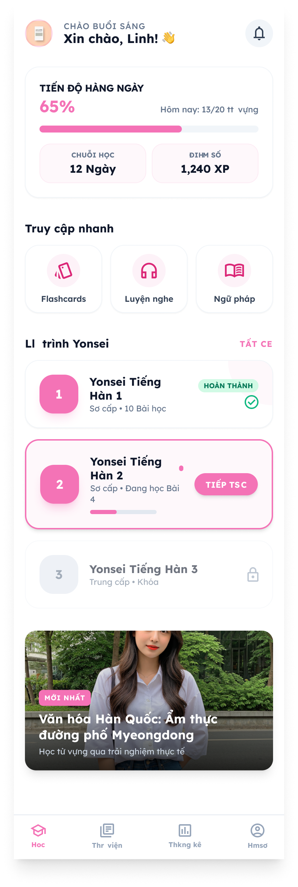</a>
  <a href="./resource/login.png" target="_blank">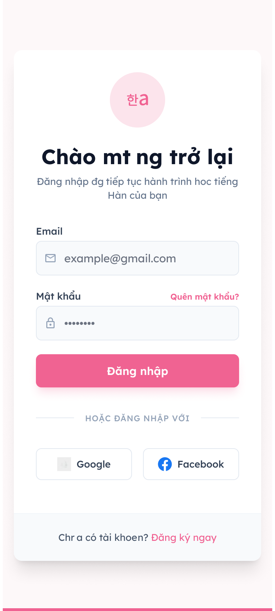</a>
  <a href="./resource/signup.png" target="_blank">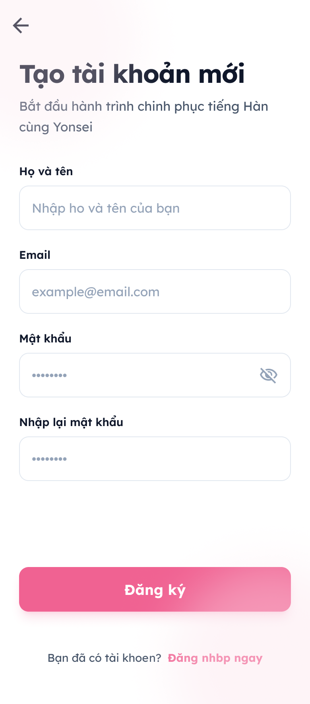</a>
  <a href="./resource/otp.png" target="_blank">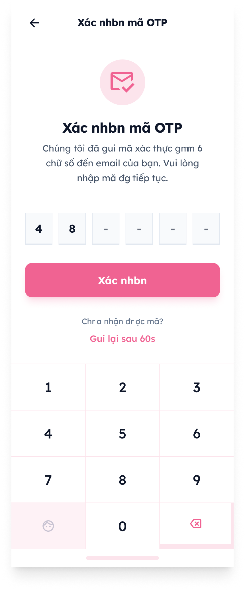</a>
  <a href="./resource/source-selection.png" target="_blank">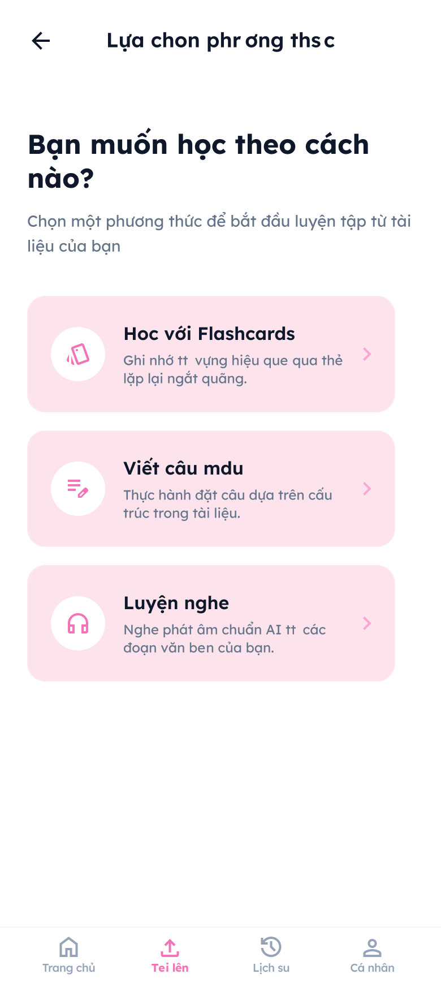</a>
  <a href="./resource/lesson-setup.png" target="_blank">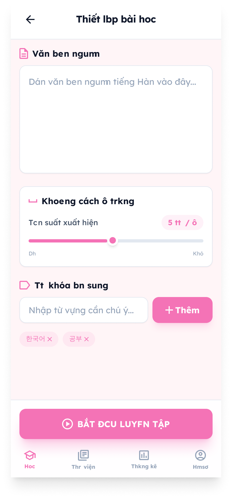</a>
  <a href="./resource/dictation.png" target="_blank">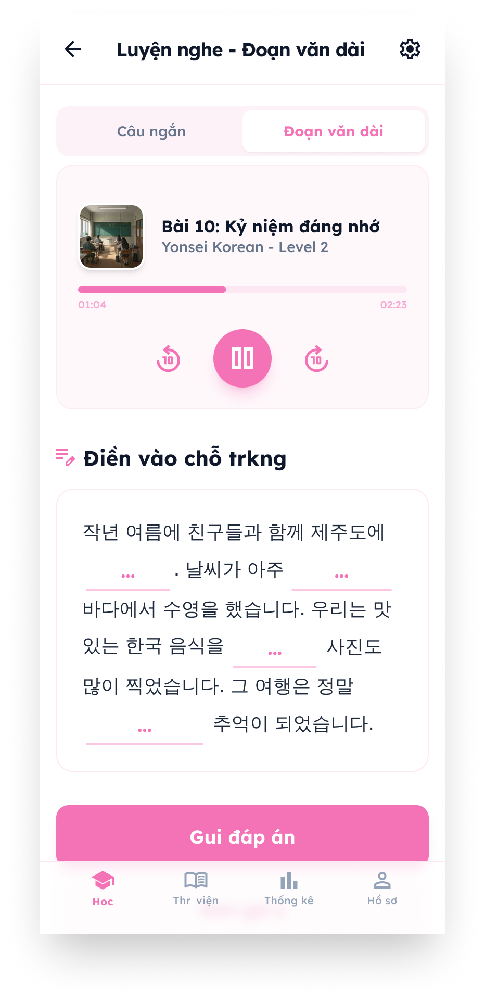</a>
  <a href="./resource/flashcards.png" target="_blank">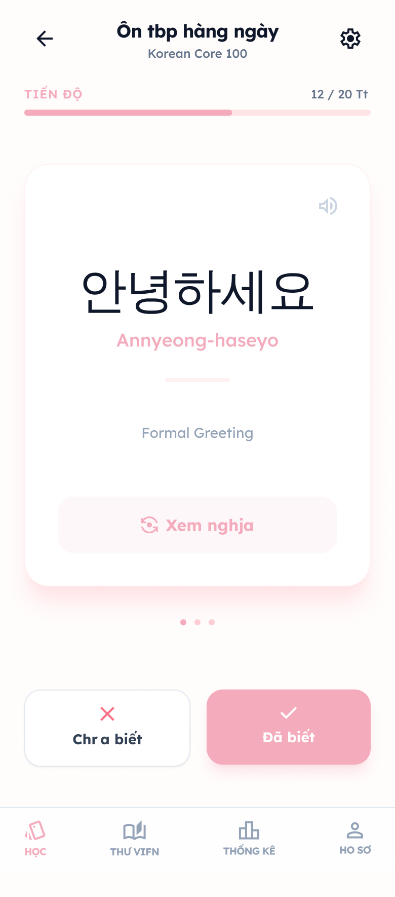</a>
</div>

<div style="display: flex; flex-wrap: wrap; gap: 2px;">

<a href="./resource/stats.png" target="_blank">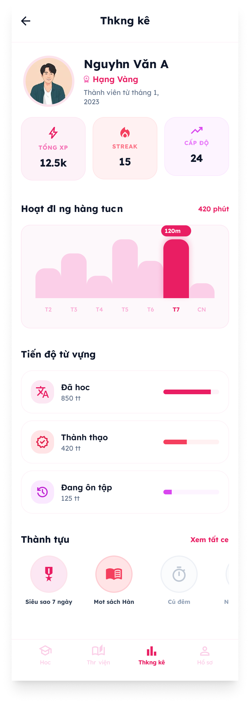</a>
<a href="./resource/exam.png" target="_blank">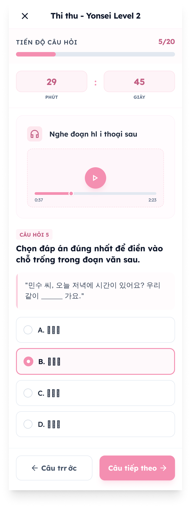</a>
<a href="./resource/exam-result.png" target="_blank">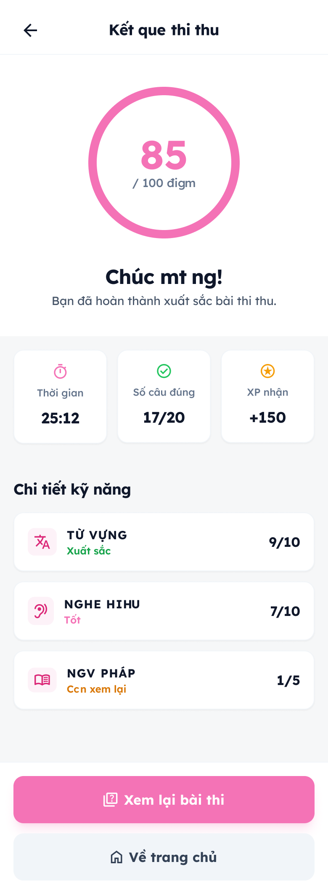</a>
<a href="./resource/lesson-complete.png" target="_blank">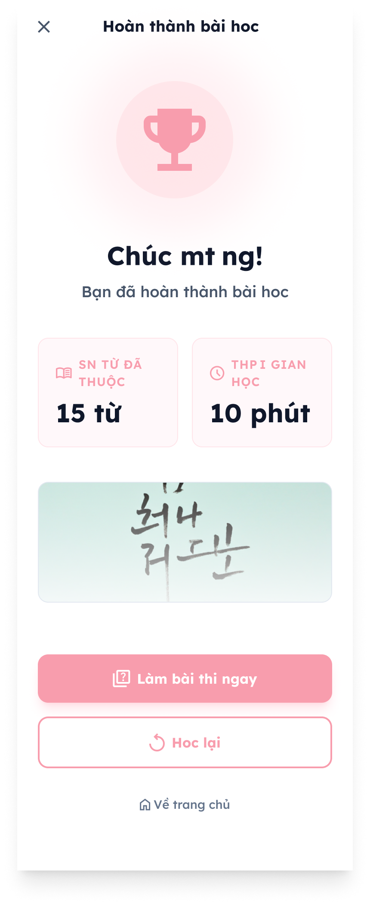</a>
<a href="./resource/profile.png" target="_blank">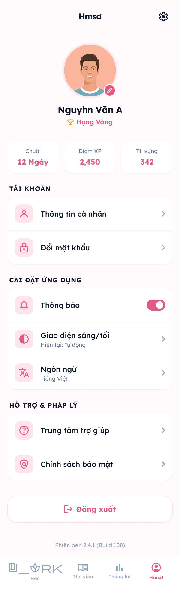</a>
<a href="./resource/listening-result.png" target="_blank">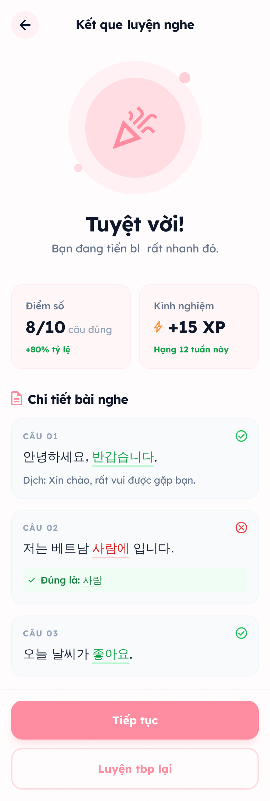</a>
<a href="./resource/auth-success.png" target="_blank">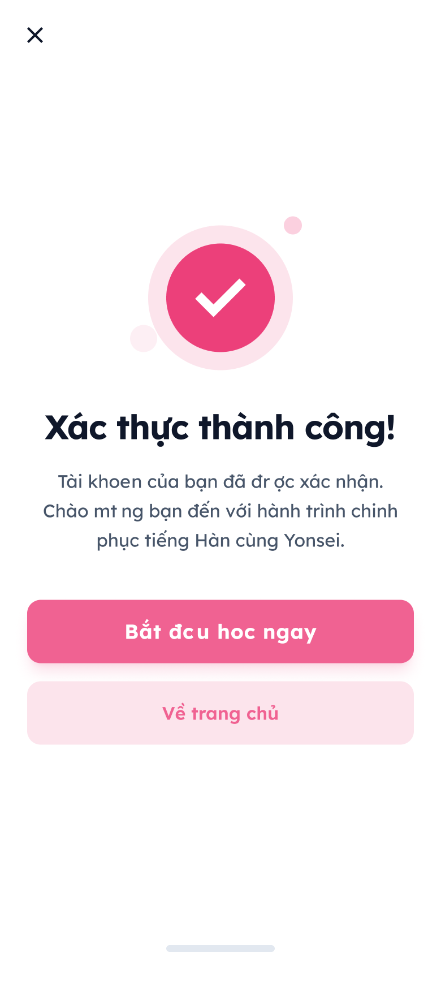</a>

</div>
## 🎨 Thiết Kế

- Màu chủ đạo: Hồng (#EC4899)
- Phong cách: Hiện đại, tối giản
- Hỗ trợ: Dark mode (tương lai)

## 📄 License

MIT License

## 👨‍💻 Đóng Góp

Mọi đóng góp đều được hoan nghênh! Vui lòng tạo issue hoặc pull request.
